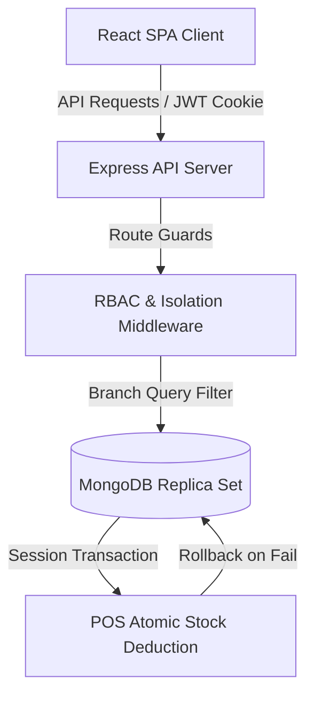

# Gourmet Haven Operations Platform

[](https://react.dev/)
[](https://nodejs.org/)
[](https://expressjs.com/)
[](https://www.mongodb.com/)
[](https://vite.dev/)

A production-grade, multi-branch Point of Sale (POS) and Inventory Management web application designed for premium dining networks. Featuring hierarchical Role-Based Access Control (RBAC), database transaction isolation, and responsive mobile-first views.

---

## Core Features

- **Premium Branding & Aesthetics**: Beautiful warm-cream theme, signature cursive `— Gourmet Haven —` lettering, and smooth Ken Burns zoom slideshow transitions.
- **Branch-Scoped Data Isolation**: Automatic middleware isolation ensuring cashiers and administrators can only access logs and catalog items corresponding to their specific branch.
- **ACID-Compliant POS Checkout**: Atomic MongoDB transactions locking stock levels upon checkout, with complete automatic rollback safety on void actions.
- **Immutable Ledger Audit Logs**: Secure, chronological record keeping for sensitive actions like voids, restocks, privilege adjustments, and discount overrides.

---

## System Architecture

The following diagram outlines the data flow between the single-page application, security middleware layers, and the MongoDB Replica Set:



---

## Repository Directory Structure

```bash
├── /backend            # Express API server, db models, routes, and controllers
├── /frontend           # React SPA client built with Vite
├── /scripts            # Shell scripts to manage MongoDB replica set initialization
└── README.md           # Documentation
```

---

## Default Seeded Credentials

Use the following seeded accounts to verify the security permissions and view restrictions (all accounts use password **`Password123`**):

| Staff Account (Actor) | Role | Branch Assignment | Permitted Operations |
| :--- | :--- | :--- | :--- |
| `superadmin@gourmethaven.com` | `SUPER_ADMIN` | Global (All) | View all branches, access full audit ledger logs, edit staff accounts. |
| `downtown.admin@gourmethaven.com` | `ADMIN` | Downtown Bistro | Restock Downtown ingredients, edit catalog products, manage Downtown cashiers. |
| `downtown.cashier@gourmethaven.com` | `CASHIER` | Downtown Bistro | Run POS terminal transactions, apply up to 10% discounts, print bills. |
| `uptown.admin@gourmethaven.com` | `ADMIN` | Uptown Café | Manage inventory refills, products, and cashiers for Uptown Café. |
| `uptown.cashier@gourmethaven.com` | `CASHIER` | Uptown Café | Handle cashier operations and bill prints for Uptown Café. |

## Production Deployments

- **Frontend Application (Vercel)**: [https://gourmet-haven-operations.vercel.app/](https://gourmet-haven-operations.vercel.app/)
- **Backend API Server (Render)**: [https://gourmet-haven-operations.onrender.com](https://gourmet-haven-operations.onrender.com)

---

## How to Run Locally

### 1. Pre-requisites
Make sure Node.js (v18+) and MongoDB are installed on your machine.

### 2. Start the Database in Replica Set Mode
Because this platform utilizes MongoDB ACID Transactions (required for atomic stock changes), a replica set is required. Execute the helper script to initialize a local `rs0` replica instance:
```bash
./scripts/start-db.sh
```

### 3. Seed Database & Launch Backend
Open a terminal in the `/backend` folder, install npm modules, run the seed script to populate products and initial branches, and start the server (default port `5001`):
```bash
cd backend
npm install
node src/seed.js
npm run dev
```

### 4. Start the Frontend
Open a new terminal in the `/frontend` folder, install client-side dependencies, and boot up the Vite dev server (runs on `http://localhost:5173`):
```bash
cd frontend
npm install
npm run dev
```

Visit `http://localhost:5173` in your browser.

---

## Running Integration Tests

To run the automated suite verifying RBAC scopes, branch isolation, and checkout rollbacks:
```bash
cd backend
npm run test
```
